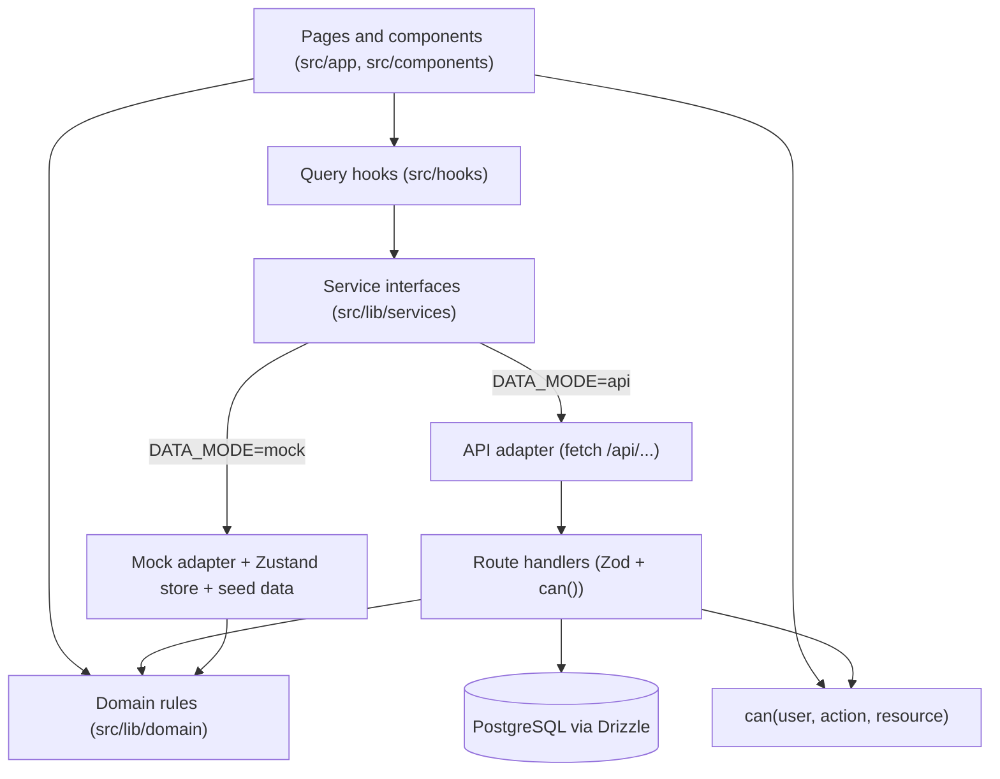

# architecture.md: Club Hub Tech Stack, Structure and Build Approach

Status: Draft v1. Depends on `prd.md` and `flow.md`. `schema.md` defines the data model and API; `design.md` defines the visual system; `rules.md` and `implementation_plan.md` tell the AI how to build.

## 1. Build approach (decided)

| Decision | Detail |
| --- | --- |
| Frontend first | Build every screen in `flow.md` against **mock data**. The backend comes later. |
| UI design | Screens are designed in Google Stitch using `design.md`, then built by Claude Code. |
| Swap-ready data layer | The UI never reads mock data directly. It calls service interfaces. A mock adapter implements them now; an API adapter replaces it later. No UI change is needed when the backend arrives. |
| Hosting | Vercel. The repository is on GitHub (created by you). |
| Authentication | MVP sign-in is employee ID only. Real authentication is the last build item. |
| Notifications | In-app only (bell, toast, page). Teams later. No email in the MVP. |

## 2. Tech stack

Pin exact versions in `package.json` at scaffold time and record them in the table below. Use the current stable major of each.

| Layer | Choice | Why |
| --- | --- | --- |
| Framework | Next.js (App Router) with React | Fast to build, deploys to Vercel with no setup, same codebase for UI and later API |
| Language | TypeScript, strict mode | Catches errors that AI-written code tends to introduce |
| Styling | Tailwind CSS with CSS variables for tokens | Matches Stitch output; one place for design tokens |
| Components | shadcn/ui (Radix primitives) | Accessible, editable, no heavy runtime |
| Icons | lucide-react | Consistent, tree-shakeable |
| Forms and validation | react-hook-form and Zod | One schema used by forms now and API routes later |
| Data fetching | TanStack Query | Caching, loading and error states, optimistic updates |
| Mock client state | Zustand with `persist` to localStorage | Simple in-browser "database" for the mock phase |
| Toasts | sonner | Lightweight, accessible |
| Dates | date-fns and date-fns-tz | IST handling without Moment's weight |
| Tables | Plain semantic tables, TanStack Table only if sorting or filtering needs it | Keeps the bundle small |
| Testing | Vitest and Testing Library; Playwright later | Unit tests for business rules first |
| Lint and format | ESLint and Prettier | Consistency |

Backend stack (later, not built now):

| Layer | Choice | Notes |
| --- | --- | --- |
| Database | PostgreSQL (Supabase managed, or self-hosted if IT requires) | Schema in `schema.md` |
| ORM and migrations | Drizzle | Light, SQL-like, types inferred from schema |
| API | Next.js Route Handlers under `/api` with Zod validation | Same repo |
| File storage | Supabase Storage (S3-compatible), private bucket, signed URLs | Agenda files and proof uploads |
| Live updates | Supabase Realtime, or server-sent events; polling every 10 to 15 seconds as fallback | Role board and notifications |
| Scheduled jobs | One endpoint, `/api/cron/tick`, called every 10 minutes | See section 7 |
| Real authentication | Auth.js or Supabase Auth, added last | Sign-in layer is already isolated (section 5) |

## 3. Layers



Rules of the layers:

1. Components never import from `src/lib/adapters/*`. They use hooks that call `src/lib/services`.
2. Business rules live in `src/lib/domain` as pure functions (no React, no database) and are shared by the mock adapter, the API routes and the UI.
3. Permissions live in one function, `can(user, action, resource)`, used by the UI to hide controls and by the server to refuse actions.
4. Every service method returns a Promise, even in mock mode, so switching to the API needs no code change in callers.
5. Every write goes through a service method that also writes the audit-log entry and creates any notifications and tasks required by `flow.md`.

## 4. Directory structure

```text
club-hub/
├── CLAUDE.md                      # points Claude Code at docs/ and rules.md
├── docs/
│   ├── prd.md
│   ├── flow.md
│   ├── architecture.md
│   ├── design.md
│   ├── schema.md
│   ├── mock-data.md
│   ├── rules.md
│   └── implementation_plan.md
├── design/
│   └── stitch-exports/            # raw Stitch output, reference only, never imported
├── public/
├── src/
│   ├── app/
│   │   ├── (auth)/login/page.tsx                    # S-01
│   │   ├── (app)/layout.tsx                         # shell: sidebar, top bar, bell, toasts
│   │   ├── (app)/home/page.tsx                      # S-02
│   │   ├── (app)/meetings/page.tsx                  # S-03
│   │   ├── (app)/meetings/new/page.tsx              # S-05
│   │   ├── (app)/meetings/templates/page.tsx        # S-06
│   │   ├── (app)/meetings/[id]/page.tsx             # S-04 (tabs)
│   │   ├── (app)/meetings/[id]/edit/page.tsx        # S-05
│   │   ├── (app)/tasks/page.tsx                     # S-07
│   │   ├── (app)/notifications/page.tsx             # S-08
│   │   ├── (app)/progress/page.tsx                  # S-09
│   │   ├── (app)/progress/club/page.tsx             # S-10
│   │   ├── (app)/members/page.tsx                   # S-11
│   │   ├── (app)/members/[id]/page.tsx              # S-12
│   │   ├── (app)/positions/page.tsx                 # S-13
│   │   ├── (app)/votes/page.tsx                     # S-14
│   │   ├── (app)/votes/[id]/page.tsx                # S-15
│   │   ├── (app)/audit/page.tsx                     # S-16
│   │   ├── (app)/export/page.tsx                    # S-17
│   │   ├── (app)/settings/page.tsx                  # S-18
│   │   ├── access-denied/page.tsx                   # G-05
│   │   └── api/                                     # later: route handlers
│   ├── components/
│   │   ├── ui/                    # shadcn primitives
│   │   ├── layout/                # Sidebar, TopBar, BellMenu, ToastHost, PageHeader
│   │   ├── meetings/              # MeetingCard, MeetingTabs, LifecycleStepper, AgendaPanel
│   │   ├── roles/                 # RoleBoard, RoleSlot, SpeakerForm, SwapDialog, AssignDialog
│   │   ├── reports/               # TimerForm, AhCounterForm, GrammarianForm, SummaryForm, ConsolidatedReport
│   │   ├── progress/              # LogCompletionDialog, ProgressTable, VerifyQueue
│   │   ├── votes/                 # VoteForm, Ballot, TurnoutBar, ResultPanel
│   │   └── shared/                # StatusBadge, EmptyState, ErrorState, ConfirmDialog, Avatar, FileUpload
│   ├── hooks/                     # useMeetings, useRoles, useTasks, useNotifications, ...
│   ├── lib/
│   │   ├── domain/
│   │   │   ├── types.ts           # entity and enum types (from schema.md)
│   │   │   ├── schemas.ts         # Zod schemas
│   │   │   ├── rules/             # evaluatorEligibility, timerCard, withdrawalCutoff, oneMainRole
│   │   │   └── constants.ts       # position names, status names, task and notification codes
│   │   ├── permissions/can.ts
│   │   ├── services/              # interfaces + index.ts choosing the adapter
│   │   ├── adapters/
│   │   │   ├── mock/              # store.ts, seed.ts, *.service.ts, clock.ts
│   │   │   └── api/               # later
│   │   ├── auth/                  # session.ts, getCurrentUser.ts (isolated sign-in layer)
│   │   ├── time/                  # IST formatting, mock clock
│   │   └── utils/
│   ├── styles/
│   │   ├── globals.css
│   │   └── tokens.css             # CSS variables from design.md
│   └── test/
├── drizzle/                       # later: schema and migrations
├── .env.example
├── package.json
└── README.md
```

## 5. Sign-in layer (isolated)

All sign-in code lives in `src/lib/auth`. The rest of the app only calls `getCurrentUser()` and `signIn(employeeId)`.

| Mode | Behavior |
| --- | --- |
| Mock | `signIn` looks up the employee ID in the mock store and saves the member ID in a cookie or localStorage. The login page shows a **Demo accounts** list (one per persona) when `NEXT_PUBLIC_DEMO_MODE=true`. |
| MVP with backend | `signIn` posts the employee ID to `/api/auth/signin`, the server checks the roster, rate-limits attempts and sets a signed httpOnly cookie. |
| Final | Replace the body of `signIn` and `getCurrentUser` with Auth.js or Supabase Auth. Member records are unchanged. |

**Security warning for the ID-only MVP.** Anyone who knows an employee ID can sign in as that person, including the President, who is admin. Vercel cannot restrict access to the company VPN on standard plans. Until real authentication exists:

1. Use mock or test data only on any publicly reachable Vercel URL. Do not put real member data behind ID-only sign-in on the open internet.
2. If real data is needed earlier, protect the deployment with Vercel's deployment protection (verify which protection options your plan includes for production), or put the app behind a company access gateway, or add the real authentication step earlier.
3. Rate-limit sign-in attempts and log every sign-in, success or failure.

## 6. Live updates

| Need | Mock phase | Backend phase |
| --- | --- | --- |
| Role board updates for other viewers | Zustand store subscription (works across tabs via the `storage` event) | Supabase Realtime channel `meeting:{id}`, or SSE; polling every 10 to 15 seconds as fallback |
| New notification toast and bell count | Store event when a service creates a notification for the current user | Channel `member:{id}`, or polling every 15 seconds |
| Concurrent role claim | Service checks the slot is still empty inside one synchronous store update; the loser gets a `CONFLICT` error | Single SQL statement `UPDATE ... WHERE assigned_member_id IS NULL`; zero rows updated means `409 CONFLICT` |

## 7. Scheduled jobs

One endpoint, `/api/cron/tick`, runs every 10 minutes, protected by `CRON_SECRET`. Each run is safe to repeat (idempotent). In mock mode, a `setInterval` in the app shell calls the same functions against the mock store.

| Job | Rule | Creates |
| --- | --- | --- |
| Generate recurring meetings | For each active template, create Draft meetings up to the configured weeks ahead; skip dates in the template's skip list | Meetings, meeting roles from the type |
| Report tasks | Meeting `ends_at` has passed and report roles exist | T-01 for each report role holder; N-06 |
| Reminders | 3 days, 1 day, 3 hours before `starts_at` | N-14 for role holders |
| Missing speech details | 3 days before, speech project or title empty | T-06 |
| Missing theme | 3 days before, theme or word of the day empty | T-07 |
| Unfilled roles | 48 hours before, open slots remain | T-08 and N-15 for ExComm |
| Close votes | Vote deadline passed | Close the vote; N-13 |

Platform note: verify the cron frequency your Vercel plan allows. Standard free plans limit cron jobs to a low frequency. If 10 minutes is not allowed, use a scheduler that can call the endpoint (for example a GitHub Actions schedule or a database scheduler) instead.

## 8. File uploads

| Item | Rule |
| --- | --- |
| Agenda file | PDF, DOCX, PNG, JPG; up to 10 MB; ExComm uploads |
| Proof for level or project completion | Same types and size; the member uploads; viewable by the member, the VPE and ExComm |
| Storage | Private bucket; files read through short-lived signed URLs |
| Mock phase | Files are kept as object URLs in memory; nothing is uploaded anywhere |
| Validation | Check extension, MIME type and size on the client and again on the server; scan files later if IT requires |

## 9. Environment variables

Create `.env.example` with these names and no values.

| Variable | Used by | Notes |
| --- | --- | --- |
| `NEXT_PUBLIC_DATA_MODE` | Service selector | `mock` (default) or `api` |
| `NEXT_PUBLIC_DEMO_MODE` | Login page | `true` shows demo accounts |
| `NEXT_PUBLIC_MOCK_NOW` | Mock clock | ISO time, for example `2026-10-01T18:00:00+05:30`; unset means real time |
| `NEXT_PUBLIC_CLUB_NAME` | UI | Display name |
| `CLUB_TIMEZONE` | Server | `Asia/Kolkata` |
| `DATABASE_URL` | Drizzle | Later |
| `SUPABASE_URL`, `SUPABASE_SERVICE_ROLE_KEY` | Storage and realtime | Later; service key is server-only |
| `STORAGE_BUCKET` | Uploads | Later |
| `SESSION_SECRET` | Signed cookie | Later |
| `CRON_SECRET` | `/api/cron/tick` | Later |
| `SEED_PRESIDENT_EMPLOYEE_ID` | Seed script | Later; the first President |

Never commit real values. Only variables starting with `NEXT_PUBLIC_` may reach the browser.

## 10. Dependencies to install (first pass)

| Package | Purpose |
| --- | --- |
| next, react, react-dom | Framework |
| typescript, @types/* | Types |
| tailwindcss, postcss, autoprefixer | Styling |
| class-variance-authority, clsx, tailwind-merge | Component variants (shadcn) |
| @radix-ui/* (through shadcn/ui) | Accessible primitives |
| lucide-react | Icons |
| react-hook-form, @hookform/resolvers, zod | Forms and validation |
| @tanstack/react-query | Data fetching |
| zustand | Mock store |
| sonner | Toasts |
| date-fns, date-fns-tz | Dates |
| vitest, @testing-library/react, jsdom | Tests |
| eslint, prettier | Quality |

Do not add any other dependency without listing it and the reason in `DECISIONS.md` (see `rules.md`).

## 11. Non-functional mapping

| PRD requirement | How the architecture meets it |
| --- | --- |
| Desktop-first, responsive | Tailwind breakpoints; layouts defined in `design.md` |
| Live role board within 5 seconds | Realtime or polling (section 6) |
| Server-side permission checks | Shared `can()` used in every route handler |
| Audit log not editable | Write-only service; database rule later (see `schema.md`) |
| IST display, UTC storage | `src/lib/time`; `timestamptz` columns |
| Club-scoped data | Every table has `club_id`; every query filters by it |
| Replace auth last | Isolated `src/lib/auth` |

## 12. Decision log

| # | Decision | Status |
| --- | --- | --- |
| D-01 | Frontend-first with mock data behind service interfaces | Decided by you |
| D-02 | UI designed in Google Stitch, built with Claude Code | Decided by you |
| D-03 | Hosting on Vercel; GitHub repository created by you | Decided by you |
| D-04 | Next.js, TypeScript, Tailwind, shadcn/ui | Proposed; accepted by default |
| D-05 | PostgreSQL with Drizzle; Supabase for storage and realtime | Proposed default, unanswered; revisit when the backend starts |
| D-06 | Cron tick every 10 minutes | Proposed default, unanswered; depends on plan limits |
| D-07 | Uploads: PDF, DOCX, PNG, JPG up to 10 MB | Proposed default, unanswered |
| D-08 | Production plus automatic preview deployments | Proposed default, unanswered |
| D-09 | Mock data only on public URLs until authentication or protection exists | Recommended; needs your confirmation |
