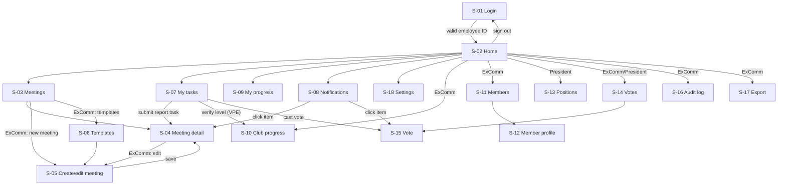
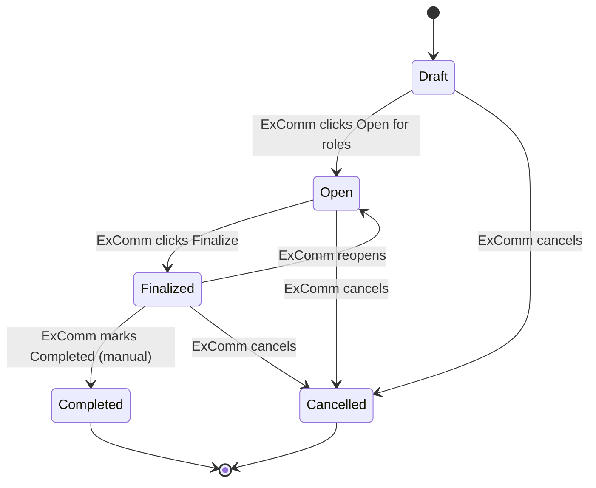

# flow.md: Club Hub User Journeys, Screen Transitions and Interaction Map

Status: Draft v1. Source of truth for screens, journeys and transitions. Depends on `prd.md`.
Later docs (`design.md`, `schema.md`, `rules.md`) must reuse the IDs below (S-xx screens, J-xx journeys, T-xx task types, N-xx notifications). Do not invent screens or transitions that are not listed here.

Items marked **[A#]** are assumptions I made where your answers did not cover the point. They are collected in section 10 for confirmation.

---

## 1. Account types and visibility

Everyone sees the same shell and the same Home screen. Widgets and actions appear or disappear by account type and by meeting role.

| Type | Who | Extra abilities over the type below it |
| --- | --- | --- |
| Member | Any club member | Browse meetings, take/withdraw roles, prepare for own roles, submit own reports, log own progress |
| ExComm | VPE, VPM, VPPR, Secretary, Treasurer, SAA | Create/edit/finalize/complete meetings, edit roles for a meeting, assign roles, upload agenda, manage members, view club progress, view audit log, export CSV, vote when a vote is open. The VPE also verifies level completions |
| President (admin) | One person at a time, seeded via the database | Everything ExComm can do, plus assign ExComm positions, name the next President, start votes |
| Meeting role holder (contextual) | A member holding a role in one meeting | Role tools for that meeting only, active until the meeting is Completed or Cancelled |

---

## 2. Screen inventory

Routes are provisional. `schema.md` finalizes them.

| ID | Route | Screen | Who can open it |
| --- | --- | --- | --- |
| S-01 | `/login` | Login (employee ID field only) | Signed-out users |
| S-02 | `/home` | Home (role-adaptive) | Everyone signed in |
| S-03 | `/meetings` | Meetings (calendar and list) | Everyone |
| S-04 | `/meetings/[id]` | Meeting detail with tabs: Overview, Agenda, Roles, Reports | Everyone; tools vary by role |
| S-05 | `/meetings/new`, `/meetings/[id]/edit` | Create or edit meeting | ExComm, President |
| S-06 | `/meetings/templates` | Recurring templates, meeting types, agenda and role templates | ExComm, President |
| S-07 | `/tasks` | My tasks | Everyone |
| S-08 | `/notifications` | Notification history | Everyone |
| S-09 | `/progress` | My progress (log projects and levels) | Everyone |
| S-10 | `/progress/club` | Club progress table and level verification queue | ExComm, President (verification actions: VPE only) |
| S-11 | `/members` | Members list (add, edit, remove) | ExComm, President |
| S-12 | `/members/[id]` | Member profile | The member; ExComm, President |
| S-13 | `/positions` | ExComm positions | President only |
| S-14 | `/votes` | Votes list | ExComm, President |
| S-15 | `/votes/[id]` | Vote: ballot, turnout, result | ExComm, President |
| S-16 | `/audit` | Audit log | ExComm, President |
| S-17 | `/export` | CSV export | ExComm, President |
| S-18 | `/settings` | Profile and notification preferences | Everyone |

Global elements (present on every signed-in screen):

| ID | Element | Behavior |
| --- | --- | --- |
| G-01 | Top bar and main navigation | Items shown depend on account type. Final item list is decided in `design.md` from this screen inventory |
| G-02 | Bell icon with unread count | Opens a dropdown of the latest notifications. "View all" goes to S-08 |
| G-03 | Toast | Appears when a new notification arrives while the user is on the page. Clicking it goes to the related action |
| G-04 | Sign out | Ends the session and returns to S-01 |
| G-05 | Access-denied page | Shown when a user opens a route they cannot use. The attempt is logged |

---

## 3. Screen transition map

---

## 4. Meeting lifecycle

State meanings (Open = "Open for roles"):

| State | Members can | ExComm can |
| --- | --- | --- |
| Draft | Not see it, or see it as "coming soon" **[A2]** | Edit everything, add/delete roles for the day, upload agenda, open it |
| Open | Take and withdraw roles, prepare for roles they hold | Everything, including assigning and reassigning roles |
| Finalized | See the confirmed agenda and roles; withdraw follows the cutoff rule **[A1]** | Everything, including reopening |
| Completed | Read the consolidated meeting report | Nothing structural; reports become read-only |
| Cancelled | See it as cancelled; role holders are notified | Nothing further |

---

## 5. Journeys

Each journey lists the actor, the screens in order, and the key interactions. "Task" and "Notification" refer to the tables in sections 6 and 7.

### J-01 Sign in and sign out
Actor: any member.
1. Open the site and land on S-01. One field: employee ID. One button: Sign in.
2. Valid ID on the roster: go to S-02. Unknown ID: stay on S-01 with a generic message that does not reveal which IDs exist.
3. Removed or deactivated member: same generic refusal.
4. Sign out (G-04) returns to S-01. An idle session expiry also returns to S-01.
5. Opening any signed-in URL while signed out redirects to S-01, then returns to the original URL after sign-in.

### J-02 Home (role-adaptive)
Actor: everyone. Same layout for all; widgets differ.

| Widget | Member | ExComm | President |
| --- | --- | --- | --- |
| Next meeting card (date, theme, status, link to S-04) | Yes | Yes | Yes |
| My upcoming roles | Yes | Yes | Yes |
| Open roles I can take (respects evaluator eligibility) | Yes | Yes | Yes |
| My tasks (top items, link to S-07) | Yes | Yes | Yes |
| My progress summary | Yes | Yes | Yes |
| Roles filled vs open for the next meeting | No | Yes | Yes |
| Pending items: late-withdrawal requests, pending level verifications (VPE only), open votes | No | Yes | Yes |
| Quick actions: Create meeting, Assign role | No | Yes | Yes |
| Quick actions: Manage positions, Start vote | No | No | Yes |

### J-03 Browse meetings and open a meeting
1. From S-02 or navigation, open S-03. Toggle calendar or list view. Filter by type and status.
2. Click a meeting to open S-04.
3. S-04 tabs:
   - **Overview:** date, time, venue or link, type, theme, welcome note, word of the day, status.
   - **Agenda:** the agenda uploaded by ExComm and the role list in agenda order.
   - **Roles:** signup board (J-04) and role-holder tools (J-05, J-06).
   - **Reports:** submission forms for report roles (J-08). After Completed, the consolidated report for everyone.
4. Cancelled meetings show a banner and remain readable.

### J-04 Take, withdraw and swap a meeting role
Actor: any member; ExComm for overrides.
1. Open S-04, Roles tab. Each role is a slot: filled (name shown) or open with **Take this role**.
2. Take a role: any member can take an open role for themselves. No approval is needed. **[A4]**
   - Blocked if the member already holds a main role in this meeting. A message explains why.
   - Evaluator slots are enabled only if the member has completed the speaker's level or is in the next level. Otherwise the button is disabled with the reason shown. **[A10]**
   - If two members click the same slot together, the first wins and the second sees a toast, "Already taken", with the refreshed board.
3. Withdraw: more than 24 hours before the meeting, the slot reopens at once and ExComm is notified. Inside 24 hours, the member sends a request that ExComm approves or rejects (Task T-04). **[A3]**
4. Swap: a member clicks **Request swap** on their role, picks another member, and the other member accepts or declines. On accept, both roles change and ExComm is notified. Swaps are blocked if either side would break the one-main-role rule.
5. ExComm can assign a member to any slot, reassign, or clear a slot at any time from the same board. The member is notified. The action is written to the audit log.

### J-05 Prepare for a role (Speaker and Evaluator)
1. **Speaker:** on S-04 Roles tab, their slot shows a form: Pathways project (list with preloaded standard time limits), speech title, objectives. The time limit appears once the project is chosen.
2. If the project or title is missing 3 days before the meeting, the member gets Task T-06.
3. **Evaluator:** after taking the slot, the member sees the speaker's name, project and objectives, and a link to that project's evaluation form.
4. If the speaker changes project after an evaluator signed up, the evaluator is notified and the link updates.

### J-06 TMOD sets theme, welcome note and word of the day
1. The TMOD opens S-04 for their meeting, Overview tab. Editable fields: theme, welcome note, word of the day. Nobody else sees edit controls (except ExComm).
2. Save publishes the values to everyone at once on the Overview tab and the Home next-meeting card. A notification (N-05) goes to all members.
3. Edit rights end when the meeting is Completed or Cancelled. A later meeting does not carry them over.

### J-07 ExComm creates, opens, finalizes and completes a meeting
Actor: ExComm or President.
1. **Create:** from S-03 click New meeting (S-05). Choose an existing meeting type (its roles and agenda outline are pre-configured), then set date, time, venue or link, and theme.
2. **Edit roles for the day:** on S-05 the role list is pre-filled from the type. ExComm can add roles or delete roles for this meeting only. The template is not changed.
3. Save. The meeting is Draft.
4. Meetings generated from a recurring template also arrive as Draft. **[A2]**
5. **Open for roles:** click Open for roles on S-04 or S-05. Members are notified (N-01).
6. **Upload agenda:** on S-05 or S-04 Agenda tab, ExComm uploads the agenda file. Members read it on the Agenda tab of S-04.
7. **Finalize:** when roles are settled, click Finalize. Role holders are notified with the confirmed agenda (N-02). **[A1]**
8. **Reschedule or cancel:** editing the date or time notifies role holders (N-03). Cancelling moves the meeting to Cancelled and notifies role holders (N-04).
9. **Complete:** after the meeting, ExComm clicks Mark completed. There is no automatic completion. On completion the consolidated report becomes visible to all members and role-holder edit rights end.

Setup of types and templates (S-06): ExComm adds a meeting type with its role list and agenda outline, or a recurring template (day, time, venue or link, type). When a new type or template is saved, all members are notified (N-08). Editing a template changes future meetings only.

### J-08 Submit a role report
Actor: Timer, Ah-Counter, Grammarian, Table Topics Master, General Evaluator.
1. When the meeting end time passes, each report role holder gets Task T-01 in S-07 and on Home, plus a notification (N-06). Reports can only be submitted after the end time.
2. Clicking the task opens S-04, Reports tab, on the correct form.
3. Timer form: per speaker, time taken. The card colour (green, yellow, red, disqualified) is calculated from the slot's time limits. Preloaded common project timings apply; ExComm can set custom timings.
4. Ah-Counter form: per-speaker filler-word total, with an optional breakdown by word.
5. Grammarian form: word-of-the-day usage, good language, improvements.
6. Table Topics Master and General Evaluator: short summary.
7. Submit. The task is marked done. Reports remain editable by their author until ExComm marks the meeting Completed. **[A7]**
8. ExComm sees who has not submitted on the Reports tab and on Home pending items.

### J-09 Log progress and VPE verification
1. Member opens S-09 and clicks Log completion: choose project or level, date, and an optional proof upload.
2. A project completion counts immediately. A level completion is created as Pending and the VPE gets Task T-03 and a notification (N-09).
3. The VPE opens the verification queue in S-10, reviews, and clicks Verify or Reject with an optional note.
4. On Verify, the member's current level updates and the member is notified (N-10). On Reject, the member is notified with the note and can resubmit.
5. ExComm view of S-10: club-wide table (path, level, projects, roles taken, speeches, last activity) with a filter for members inactive for N days.

### J-10 Manage members
Actor: ExComm or President.
1. S-11 lists members. Actions: Add member (employee ID, name, email, Toastmasters ID), Edit, Deactivate/Remove, CSV import for the first load.
2. Removing a member who holds roles in upcoming meetings shows those roles first. ExComm must reassign or release them before confirming.
3. The member's past roles and reports stay in history.
4. Clicking a member opens S-12. Members can edit their own pathway and contact fields on their own S-12; ExComm can edit all other fields.

### J-11 President manages ExComm positions
Actor: President only. Others never see the route (G-05 if opened by URL).
1. First run: the President is seeded through the database. They sign in through J-01.
2. Open S-13. The screen lists the ExComm positions (VPE, VPM, VPPR, Secretary, Treasurer, SAA) and the President, each with the current holder and a **Change holder** action.
3. Change holder: pick a member from a picker, then confirm in a dialog. The previous holder returns to plain Member. **[A6]** The new holder is notified (N-11). The change is written to the audit log.
4. Name next President: same flow on the President row. On confirm, admin rights move to the new President and the outgoing President becomes a plain Member.
5. ExComm members cannot change or swap positions.

### J-12 ExComm voting
Actor: President starts; ExComm and President vote.
1. President opens S-14 and clicks Start vote. Form: title, description, options (default Yes / No / Abstain), optional deadline. **[A5]**
2. On start, every eligible voter gets Task T-05 and a notification (N-12). Eligible voters are the ExComm members and the President. **[A5]**
3. A voter opens S-15, picks one option, and confirms. A cast vote is final. **[A5]**
4. While the vote is open, nobody can see results, including the President. The page shows only turnout (how many of the eligible voters have voted). **[A5]**
5. The vote closes at the deadline or when the President clicks Close vote.
6. After closing, results are shown on S-15 to the eligible voters. Voter-to-choice mapping is not displayed. **[A5]**
7. Start, close and every cast are recorded in the audit log without linking a person to their choice.

### J-13 Notifications (bell and toast)
1. Any event in section 7 creates a notification for each recipient.
2. If the recipient is on the page, a toast appears (G-03) and the bell count increases.
3. If not, the notification waits in the bell dropdown and on S-08 until read.
4. Clicking a toast or a bell item goes straight to the related action and marks it read.
5. Members can opt out of non-critical types on S-18. Role changes, cancellations and reminders for one's own roles cannot be turned off.

### J-14 Audit log and export
1. ExComm opens S-16: filterable list of role changes, withdrawals, overrides, cancellations, member and position changes, verifications, votes. Each row shows actor, time and before/after values.
2. ExComm opens S-17, picks roles, meeting history or progress, and downloads a CSV.

---

## 6. Task types (S-07 and Home)

Tasks are generated by the system. A task disappears when its action is done.

| ID | Task | Recipient | Appears when | Opens |
| --- | --- | --- | --- | --- |
| T-01 | Submit your report | Report role holders | Meeting end time passes | S-04 Reports tab |
| T-02 | Approve or reject late withdrawal | ExComm | A member requests withdrawal inside the cutoff **[A3]** | S-04 Roles tab |
| T-03 | Verify level completion | VPE | A member logs a level completion | S-10 verification queue |
| T-04 | Answer swap request | The other member | A swap is requested | S-04 Roles tab |
| T-05 | Cast your vote | ExComm and President | A vote starts | S-15 |
| T-06 | Add speech project and title | Speakers | 3 days before the meeting and details are missing | S-04 Roles tab |
| T-07 | Set theme and word of the day | TMOD | 3 days before the meeting and not yet set | S-04 Overview tab |
| T-08 | Fill open roles | ExComm | 48 hours before the meeting with unfilled roles | S-04 Roles tab |

---

## 7. Notification triggers

| ID | Trigger | Recipient | Click goes to |
| --- | --- | --- | --- |
| N-01 | Meeting opened for roles | All members | S-04 Roles tab |
| N-02 | Meeting finalized | Role holders | S-04 Agenda tab |
| N-03 | Meeting rescheduled | Role holders | S-04 Overview |
| N-04 | Meeting cancelled | Role holders | S-04 Overview |
| N-05 | Theme or word of the day published | All members | S-04 Overview |
| N-06 | Report due (meeting ended) | Report role holders | S-04 Reports tab |
| N-07 | Role assigned, changed or removed by ExComm | Affected member | S-04 Roles tab |
| N-08 | New meeting type, agenda template or role list added | All members | S-06 (read view) or S-03 |
| N-09 | Level completion logged | VPE | S-10 verification queue |
| N-10 | Level verified or rejected | The member | S-09 |
| N-11 | Position assigned or removed | Affected member | S-02 |
| N-12 | Vote started | ExComm and President | S-15 |
| N-13 | Vote closed, results available | ExComm and President | S-15 |
| N-14 | Reminders: 3 days, 1 day, a few hours before | Role holders | S-04 Roles tab |
| N-15 | Unfilled roles 48 hours before the meeting | ExComm (and all members if ExComm chooses) | S-04 Roles tab |
| N-16 | Swap requested, accepted or declined | Members involved | S-04 Roles tab |
| N-17 | Withdrawal request decided | The requesting member | S-04 Roles tab |

---

## 8. Shared interaction rules

- Every role action on S-04 updates the board for other viewers without a page reload.
- Every write that changes roles, positions, members, votes or verifications creates an audit-log entry.
- Permission checks run on the server. Hiding a button is never the only protection.
- A route the user is not allowed to open shows G-05 and is logged.
- Every list screen has three states: loading, empty (with a plain message and the main action if the user may take it), and error (with Retry).
- Destructive actions (remove member, cancel meeting, change holder, close vote) need a confirmation dialog.

---

## 9. First-run journey

1. A developer seeds the database with the first President's employee ID.
2. The President signs in (J-01) and lands on Home.
3. The President or an ExComm member adds members through S-11 (CSV import) (J-10).
4. The President assigns ExComm positions on S-13 (J-11).
5. ExComm sets up meeting types and a recurring template on S-06 (J-07).
6. Generated meetings appear as Draft. ExComm opens the first one for roles.

---

## 10. Assumptions to confirm

| # | Assumption | Why I assumed it |
| --- | --- | --- |
| A1 | Finalized means the agenda and roles are confirmed. Members can still withdraw under the cutoff rule, and ExComm can still edit or reopen | You said ExComm finalizes by clicking but not what it locks |
| A2 | Meetings generated from a template start as Draft, and ExComm opens them (a bulk "Open all drafts" action is allowed). Members do not see Draft meetings in the role board | Matches the PRD; you did not say if generated meetings open automatically |
| A3 | Taking a role needs no approval, but withdrawing inside 24 hours still needs ExComm approval (T-02) | You said no approval to assign; the PRD cutoff was not mentioned |
| A4 | Members take roles for themselves only. ExComm can assign anyone | "Anyone can assign" was read as self-service |
| A5 | Votes: free-text title and options (default Yes/No/Abstain); voters are ExComm and the President; one final vote each; turnout visible while open; results visible to voters after close; secret ballot; closes at deadline or by the President | You gave who starts and that results stay hidden; the rest is my default |
| A6 | The outgoing President and any replaced position holder become plain Members | Matches the PRD |
| A7 | Report forms open when the meeting end time passes and stay editable until ExComm marks Completed | You said reports are due after the meeting ends |
| A8 | Members see names only through meeting pages (role board); the members directory (S-11) is ExComm and President only | Keeps the member list private by default |
| A9 | Navigation items are decided in `design.md` (done: design.md section 3) | Your answer to question 2 |
| A10 | The evaluator eligibility rule compares level numbers regardless of pathway | PRD open question 9 |

---

## 11. PRD changes this document implies (status: all applied to prd.md)

Apply these to `prd.md` so the document set stays consistent:

1. FR-14 and US-4: taking a role needs no approval; ExComm can also assign; withdrawal cutoff kept (A3).
2. New FR: ExComm uploads an agenda file per meeting, shown on the Agenda tab of the meeting page.
3. New FR: a My tasks list (T-01 to T-08) on Home and S-07.
4. FR-36: toast shown when a notification arrives and the user is live on the page.
5. FR-44 ExComm voting: replace the placeholder with J-12 and A5.
6. Open questions 12 and 13: mark 12 Decided (seeded through the database) and update 13 with your answer.
7. FR-10: Completed is set manually by ExComm.
8. FR-21: TMOD publish also notifies all members (N-05).
