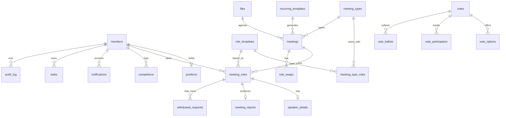

# schema.md: Club Hub Data Model, Rules in Data, and API Contract

Status: Draft v1. Source of truth for entity names, fields, enums and API routes.
Related: `prd.md` (FR-IDs), `flow.md` (S/J/T/N IDs), `architecture.md` (layers), `mock-data.md` (seed).

How to use this file in vibe coding:
- **Phase 1 (mock):** turn Section 3 into `src/lib/domain/types.ts` and Section 9 into service interfaces. The mock store holds the same shapes.
- **Phase 2 (backend):** turn Section 3 into Drizzle tables and Section 9 into route handlers. Nothing in the UI changes.
- Field names are `snake_case` in the database and `camelCase` in TypeScript. Do not invent fields that are not listed here. If a field is missing, add it here first.

---

## 1. Conventions

| Topic | Rule |
| --- | --- |
| IDs | `uuid` primary key named `id` on every table (mock: `crypto.randomUUID()`; seed uses readable fixed IDs, see `mock-data.md`) |
| Times | `timestamptz`, stored UTC, shown in IST (`Asia/Kolkata`) (FR-43). Meeting date and time are one field: `starts_at` |
| Durations | Integer seconds (`*_seconds`) |
| Soft delete | Members are never hard deleted. `status = 'removed'` blocks sign-in and keeps history (FR-03) |
| Audit | Every write listed in Section 7 also writes an `audit_log` row in the same transaction |
| Timestamps | `created_at`, `updated_at` on every table except append-only ones (`audit_log`, `vote_ballots`) which have `created_at` only |
| Text | Free text is trimmed. Max lengths are in the table notes |

---

## 2. Enums

```ts
export const ACCOUNT_TYPES = ['member', 'excomm', 'president'] as const;
export const POSITIONS = ['president','vpe','vpm','vppr','secretary','treasurer','saa'] as const;
export const MEMBER_STATUS = ['active','inactive','removed'] as const;
export const MEETING_STATUS = ['draft','open','finalized','completed','cancelled'] as const;
export const ROLE_CATEGORY = ['main','support','report'] as const; // report roles get a report form
export const REPORT_KIND = ['timer','ah_counter','grammarian','table_topics','general_evaluator'] as const;
export const SLOT_STATUS = ['open','filled'] as const;
export const WITHDRAWAL_STATUS = ['pending','approved','rejected'] as const;
export const SWAP_STATUS = ['pending','accepted','declined','cancelled'] as const;
export const COMPLETION_KIND = ['project','level'] as const;
export const COMPLETION_STATUS = ['counted','pending','verified','rejected'] as const; // projects are 'counted'; levels start 'pending'
export const CARD = ['green','yellow','red','disqualified','none'] as const;
export const VOTE_STATUS = ['open','closed'] as const;
export const TASK_CODES = ['T-01','T-02','T-03','T-04','T-05','T-06','T-07','T-08'] as const;
export const NOTIF_CODES = ['N-01','N-02','N-03','N-04','N-05','N-06','N-07','N-08','N-09','N-10','N-11','N-12','N-13','N-14','N-15','N-16','N-17'] as const;
export const AUDIT_ACTIONS = [
  'role.assign','role.reassign','role.override','role.withdraw','role.withdraw_request','role.withdraw_decision',
  'role.swap','meeting.create','meeting.update','meeting.reschedule','meeting.cancel','meeting.status',
  'member.add','member.update','member.remove','position.assign','position.remove','president.transfer',
  'level.verify','level.reject','vote.start','vote.close','template.change','settings.change'
] as const;
```

`account_type` is derived, never edited directly: `president` if the member holds the President position, `excomm` if they hold any other position, otherwise `member`. Store it as a column for fast checks but recompute it whenever positions change.

---

## 3. Entities

### 3.1 `members`
| Column | Type | Notes |
| --- | --- | --- |
| id | uuid PK | |
| employee_id | text UNIQUE NOT NULL | Sign-in key in MVP. Stored uppercase, trimmed |
| name | text NOT NULL | max 80 |
| email | text NOT NULL | UNIQUE, lowercase |
| toastmasters_id | text NULL | |
| pathway | text NULL | Free text chosen from a suggestion list (FR-05) |
| current_level | smallint NOT NULL default 1 | 1 to 5. Changes only when a level completion is verified (FR-35) |
| account_type | enum | Derived, see Section 2 |
| status | enum MEMBER_STATUS | default `active` |
| joined_at | date NULL | |
| last_active_at | timestamptz NULL | Updated on role taken, report submitted, completion logged. Feeds S-10 "no recent activity" (FR-34) |

### 3.2 `positions`
One row per position. Seeded with the seven rows, `member_id` nullable.
| Column | Type | Notes |
| --- | --- | --- |
| id | uuid PK | |
| code | enum POSITIONS UNIQUE | |
| member_id | uuid FK members NULL | UNIQUE when not null (one position per person) |
| assigned_at | timestamptz NULL | |
| assigned_by | uuid FK members NULL | |

There is also a single-row table `club_settings` (Section 3.14) that stores `next_president_id`.

### 3.3 `meeting_types`
| Column | Type | Notes |
| --- | --- | --- |
| id | uuid PK | |
| name | text UNIQUE | e.g. Regular Meeting, Contest, Workshop, Joint Session |
| default_duration_minutes | int | |
| is_active | bool default true | |

### 3.4 `role_templates` (the catalog of roles)
| Column | Type | Notes |
| --- | --- | --- |
| id | uuid PK | |
| code | text UNIQUE | `tmod`, `speaker`, `evaluator`, `general_evaluator`, `timer`, `ah_counter`, `grammarian`, `table_topics_master`, `ttm_speaker`, `hark_master`, custom... |
| name | text | Display name |
| category | enum ROLE_CATEGORY | `main` counts toward "one main role per meeting" |
| report_kind | enum REPORT_KIND NULL | Set for roles that submit a report |
| is_speaker | bool | Speaker slots carry project, title, objectives and time limits |
| is_evaluator | bool | Evaluator slots point to a speaker slot |
| default_count | smallint | How many slots by default (e.g. 3 speakers) |

### 3.5 `meeting_type_roles` (agenda template: which roles a type starts with)
| Column | Type | Notes |
| --- | --- | --- |
| meeting_type_id | uuid FK | |
| role_template_id | uuid FK | |
| count | smallint | |
| sort_order | smallint | Order on the agenda |
| PK | (meeting_type_id, role_template_id) | |

Also `meeting_type_agenda_items` (agenda template rows): `id, meeting_type_id, sort_order, title, duration_minutes, role_template_id NULL`. Used to show an agenda outline when no file is uploaded.

### 3.6 `recurring_templates`
| Column | Type | Notes |
| --- | --- | --- |
| id | uuid PK | |
| name | text | e.g. Friday Regular Meeting |
| meeting_type_id | uuid FK | |
| weekday | smallint | 0 to 6 (Sunday = 0) |
| start_time | time | Local IST time, for example 16:00 |
| duration_minutes | int | |
| venue | text NULL | |
| meeting_link | text NULL | |
| weeks_ahead | smallint default 4 | How far to generate |
| skip_dates | date[] | Holidays |
| is_active | bool | |

### 3.7 `meetings`
| Column | Type | Notes |
| --- | --- | --- |
| id | uuid PK | |
| title | text | max 120 |
| meeting_type_id | uuid FK | |
| template_id | uuid FK NULL | Set when auto-generated. UNIQUE (template_id, starts_at) so generation is idempotent |
| starts_at | timestamptz NOT NULL | |
| ends_at | timestamptz NOT NULL | Must be after starts_at |
| venue | text NULL | |
| meeting_link | text NULL | At least one of venue or link before status can leave `draft` |
| status | enum MEETING_STATUS | default `draft` |
| theme | text NULL | Set by TMOD or ExComm |
| welcome_note | text NULL | |
| word_of_the_day | text NULL | |
| word_meaning | text NULL | |
| theme_published_at | timestamptz NULL | Set when TMOD saves; triggers N-05 |
| agenda_file_id | uuid FK files NULL | FR-45 |
| withdrawal_cutoff_hours | smallint NULL | NULL means use club default (24) |
| cancelled_reason | text NULL | |
| completed_at | timestamptz NULL | |
| created_by | uuid FK members | |

### 3.8 `meeting_roles` (slots)
| Column | Type | Notes |
| --- | --- | --- |
| id | uuid PK | |
| meeting_id | uuid FK | ON DELETE CASCADE |
| role_template_id | uuid FK | |
| label | text | "Speaker 1", "Evaluator 2" |
| sort_order | smallint | |
| member_id | uuid FK members NULL | NULL means open |
| status | enum SLOT_STATUS | Derived from member_id but stored for filtering |
| is_main | bool | Copied from the role template category at creation |
| assigned_by | uuid FK members NULL | Self or ExComm |
| assigned_at | timestamptz NULL | |
| version | int default 0 | Optimistic concurrency, see Section 5 |
| evaluates_slot_id | uuid FK meeting_roles NULL | Evaluator slot points to a speaker slot |

Constraints:
- Partial unique index: `UNIQUE (meeting_id, member_id) WHERE is_main AND member_id IS NOT NULL` (one main role per member per meeting, FR-16).
- Check: `(member_id IS NULL) = (status = 'open')`.

### 3.9 `speaker_details` (1:1 with a speaker slot)
| Column | Type | Notes |
| --- | --- | --- |
| meeting_role_id | uuid PK FK | |
| pathway | text NULL | Defaults to member's pathway |
| level | smallint NULL | Speaker's level for this speech; used by evaluator rule |
| project_id | uuid FK pathways_projects NULL | |
| project_name | text NULL | Denormalised for custom projects |
| title | text NULL | max 120 |
| objectives | text NULL | |
| min_seconds | int NULL | From project or custom |
| max_seconds | int NULL | |
| eval_form_url | text NULL | Link shown to the evaluator (FR-22) |

### 3.10 `pathways_projects` (preloaded common timings, FR-24)
| Column | Type | Notes |
| --- | --- | --- |
| id | uuid PK | |
| pathway | text | |
| level | smallint | |
| name | text | |
| min_seconds | int | |
| max_seconds | int | |
| is_custom | bool | Custom rows added by ExComm |

Seed with a small set of common timings, marked "verify with VPE" (see `mock-data.md`).

### 3.11 Reports
`meeting_reports` (one per report role slot)
| Column | Type | Notes |
| --- | --- | --- |
| id | uuid PK | |
| meeting_id | uuid FK | |
| meeting_role_id | uuid FK UNIQUE | The report role slot |
| kind | enum REPORT_KIND | |
| submitted_by | uuid FK members | |
| submitted_at | timestamptz NULL | NULL while draft |
| payload | jsonb | Validated by the Zod schema for `kind` (below) |

Payload shapes (Zod in `schemas.ts`):
```ts
TimerPayload        = { rows: { speakerSlotId: string; seconds: number; card: Card }[] }   // card computed, see rules.md R-04
AhCounterPayload    = { rows: { memberId: string; total: number; breakdown?: Record<string, number> }[] }
GrammarianPayload   = { wordOfDayUsage: { memberId: string; count: number }[]; goodLanguage: string; improvements: string }
SummaryPayload      = { summary: string }   // table_topics and general_evaluator
```

### 3.12 Progress
`completions`
| Column | Type | Notes |
| --- | --- | --- |
| id | uuid PK | |
| member_id | uuid FK | |
| kind | enum COMPLETION_KIND | |
| pathway | text | |
| level | smallint | |
| project_name | text NULL | Required when kind = project |
| completed_on | date | Not in the future |
| proof_file_id | uuid FK files NULL | Required only if `club_settings.proof_required` |
| status | enum COMPLETION_STATUS | project: `counted`; level: `pending` |
| verified_by | uuid FK members NULL | Must hold the VPE position |
| verified_at | timestamptz NULL | |
| rejection_reason | text NULL | Required on reject |

Verifying a level sets `members.current_level = level + 1` (max 5) in the same transaction.

### 3.13 Swaps and withdrawals
`role_swaps`: `id, meeting_id, requester_role_id, target_role_id, requester_id, target_id, status SWAP_STATUS, created_at, decided_at`. Both roles must belong to the same meeting and both must be main-role-compatible after the swap (see R-06).

`withdrawal_requests`: `id, meeting_role_id, member_id, reason NULL, status WITHDRAWAL_STATUS, decided_by NULL, decided_at NULL, created_at`. At most one pending request per slot.

### 3.14 `club_settings` (single row)
| Column | Type | Default |
| --- | --- | --- |
| id | int PK | 1 |
| club_name | text | "Inception Labs Toastmasters" (working) |
| withdrawal_cutoff_hours | smallint | 24 |
| proof_required | bool | false |
| consecutive_repeat_limit | smallint NULL | NULL (off) |
| timer_grace_seconds | smallint | 30 |
| next_president_id | uuid FK members NULL | |
| inactive_after_days | smallint | 60 |
| generate_weeks_ahead | smallint | 4 |

### 3.15 Notifications and tasks
`notifications`
| Column | Type | Notes |
| --- | --- | --- |
| id | uuid PK | |
| member_id | uuid FK | Recipient |
| code | enum NOTIF_CODES | |
| title | text | Short text shown in bell and toast |
| body | text NULL | |
| link | text | In-app path, e.g. `/meetings/{id}?tab=roles&slot={slotId}` (flow.md rule: click goes to the action) |
| read_at | timestamptz NULL | |
| created_at | timestamptz | |
| dedupe_key | text NULL | UNIQUE with member_id so reminder jobs stay idempotent |

`tasks`
| Column | Type | Notes |
| --- | --- | --- |
| id | uuid PK | |
| member_id | uuid FK | Assignee |
| code | enum TASK_CODES | |
| title | text | |
| link | text | Same rule as notifications |
| ref_type / ref_id | text / uuid | The thing the task is about (meeting_role, completion, vote...) |
| due_at | timestamptz NULL | |
| done_at | timestamptz NULL | Set when the action is done; task disappears from lists |
| dedupe_key | text | UNIQUE (member_id, dedupe_key) |

`notification_prefs`: `member_id, code, enabled`. Codes that cannot be switched off (FR-40): N-03, N-04, N-07, N-14, N-17 (own roles). Default enabled for all others.

### 3.16 Votes
`votes`: `id, title, description, status VOTE_STATUS, created_by (President), deadline_at NULL, closed_at NULL, closed_by NULL`.
`vote_options`: `id, vote_id, label, sort_order`.
`vote_participation`: `vote_id, member_id, cast_at`, PK (vote_id, member_id). Says **that** someone voted, never **what**.
`vote_ballots`: `id, vote_id, option_id, created_at`. **No member_id.** Insert both rows in one transaction so the secret ballot holds (FR-44, A5).

Turnout = count of `vote_participation` / count of eligible voters (active ExComm and President at the time the vote started; store the eligible voter IDs in `vote_eligible(vote_id, member_id)` so later position changes do not alter turnout).

### 3.17 Files and audit
`files`: `id, storage_key, original_name, mime_type, size_bytes, uploaded_by, created_at`. Allowed: PDF, DOCX, PNG, JPG; max 10 MB (architecture.md section 8).
`audit_log`: `id, actor_id, action (AUDIT_ACTIONS), entity_type, entity_id, before jsonb NULL, after jsonb NULL, created_at`. Append-only: no UPDATE or DELETE grants.

---

## 4. Entity relationships



---

## 5. Concurrency and integrity

| Case | Rule |
| --- | --- |
| Two members claim one slot (FR-19) | `UPDATE meeting_roles SET member_id=$me, status='filled', version=version+1 WHERE id=$slot AND member_id IS NULL`. Zero rows updated returns `409 SLOT_TAKEN`. The mock adapter mimics this by checking and setting inside one synchronous store action |
| Member already holds a main role | The partial unique index rejects it; map to `409 ALREADY_HAS_MAIN_ROLE` |
| ExComm reassigns while member withdraws | Use `version`; a stale write returns `409 STALE` and the UI refetches |
| Reminder jobs run twice | `dedupe_key` unique constraint; insert with `ON CONFLICT DO NOTHING` |
| Vote cast twice | PK on `vote_participation`; second attempt returns `409 ALREADY_VOTED` |
| Removing a member who holds future roles | Roles are released to `open`, member gets no notification, ExComm gets a warning listing the meetings |
| Deleting a role from a meeting that is filled | Requires confirm; the holder gets N-07 |

---

## 6. Permission matrix (implemented once as `can(user, action, resource)`)

Legend: M = Member, X = ExComm (any position), P = President, VPE = VPE position, H = holder of a role in that meeting (contextual), Self = own record.

| Action | Who |
| --- | --- |
| `meeting.view` (non-draft) | M, X, P |
| `meeting.view` (draft) | X, P |
| `meeting.create / update / cancel / status` | X, P |
| `meeting.complete` | X, P |
| `meeting.theme.edit` | TMOD holder of that meeting (H) while status is not completed/cancelled; X, P |
| `meeting.agenda.upload` | X, P |
| `role.claim` (self) | M, X, P when meeting is `open` or `finalized` |
| `role.assign / reassign / override` | X, P |
| `role.withdraw` | Self; outside cutoff immediate, inside cutoff creates request |
| `role.withdraw.decide` | X, P |
| `role.swap.request` | Self (must hold a role in the meeting) |
| `role.swap.respond` | Target member |
| `speaker.details.edit` | Speaker slot holder; X, P |
| `evaluator.claim` | Self, only if eligible (rules.md R-03); X, P override |
| `report.submit / edit` | Holder of that report role; edits allowed until meeting is `completed` (A7) |
| `report.view` consolidated | M, X, P once meeting is `completed`; holders and X, P earlier |
| `template.edit / meeting_type.edit` | X, P |
| `member.add / update / remove` | X, P |
| `member.view_directory` | X, P (members see names via meeting pages only, A8) |
| `member.edit_self` (pathway, email, name, prefs) | Self |
| `position.assign / remove`, `president.transfer` | P only |
| `completion.log` | Self |
| `completion.verify` | VPE only (P does not verify unless P also holds VPE, which is not possible) |
| `club_progress.view` | X, P |
| `vote.start / close` | P |
| `vote.cast` | Eligible voter (X, P) once |
| `vote.view_turnout` | X, P |
| `vote.view_result` | X, P after close |
| `audit.view`, `export.run` | X, P |
| `settings.club.edit` | P |

Rule: every route handler and every mock service call `can()` first. Failing returns `403 FORBIDDEN` and writes a `permission.denied` audit note (flow.md G-05).

---

## 7. Audit triggers

Write an `audit_log` row for: each role assignment (self or ExComm), reassignment, override, withdrawal (immediate, requested, decided), swap accepted, meeting create/update/reschedule/cancel/status change, member add/update/remove, position assign/remove, president transfer, level verify/reject, vote start/close, template and meeting-type changes, club settings changes. `before` and `after` hold only the changed fields.

---

## 8. Error codes (shared by mock and API)

| HTTP | Code | Meaning |
| --- | --- | --- |
| 400 | `VALIDATION` | Zod failure; body includes `fields` map |
| 401 | `UNAUTHENTICATED` | No session |
| 403 | `FORBIDDEN` | `can()` said no |
| 404 | `NOT_FOUND` | |
| 409 | `SLOT_TAKEN` | Slot filled by someone else first |
| 409 | `ALREADY_HAS_MAIN_ROLE` | One main role per meeting |
| 409 | `ALREADY_VOTED` | |
| 409 | `STALE` | Version mismatch |
| 409 | `INVALID_STATE` | Action not allowed in the current meeting or vote status |
| 422 | `NOT_ELIGIBLE` | Evaluator rule failed; body has `reason` |
| 422 | `INSIDE_CUTOFF` | Withdrawal needs approval; UI switches to request flow |
| 423 | `CLOSED` | Vote closed or meeting completed |
| 500 | `INTERNAL` | |

Error body shape: `{ "error": { "code": "SLOT_TAKEN", "message": "Someone just took this role.", "fields"?: {..} } }`.

---

## 9. Service interfaces and API routes

Each service is a TypeScript interface in `src/lib/services/`; mock and API adapters implement it. Route paths below are for the API adapter later. All routes require a session except sign-in.

| Service | Method | Route | Screen |
| --- | --- | --- | --- |
| auth | `signIn(employeeId)` | `POST /api/auth/sign-in` | S-01 |
| auth | `signOut()` | `POST /api/auth/sign-out` | G-04 |
| auth | `getCurrentUser()` | `GET /api/me` | all |
| meetings | `list({from,to,type,status})` | `GET /api/meetings` | S-03, S-02 |
| meetings | `get(id)` | `GET /api/meetings/:id` | S-04 |
| meetings | `create / update / cancel` | `POST /api/meetings`, `PATCH /api/meetings/:id`, `POST /api/meetings/:id/cancel` | S-05 |
| meetings | `setStatus(id, status)` | `POST /api/meetings/:id/status` | S-04 |
| meetings | `publishTheme(id, {theme, welcomeNote, wordOfTheDay, wordMeaning})` | `PUT /api/meetings/:id/theme` | S-04 Overview |
| meetings | `uploadAgenda(id, file)` | `POST /api/meetings/:id/agenda` | S-04 Agenda |
| roles | `listForMeeting(id)` | `GET /api/meetings/:id/roles` | S-04 Roles |
| roles | `addSlot / removeSlot` | `POST/DELETE /api/meetings/:id/roles` | S-05, S-04 |
| roles | `claim(slotId)` | `POST /api/roles/:slotId/claim` | S-04 |
| roles | `assign(slotId, memberId)` | `POST /api/roles/:slotId/assign` | S-04 |
| roles | `withdraw(slotId, reason?)` | `POST /api/roles/:slotId/withdraw` | S-04 |
| roles | `decideWithdrawal(reqId, decision)` | `POST /api/withdrawals/:id/decide` | S-04, T-02 |
| roles | `requestSwap / respondSwap` | `POST /api/swaps`, `POST /api/swaps/:id/respond` | S-04, T-04 |
| roles | `saveSpeakerDetails(slotId, data)` | `PUT /api/roles/:slotId/speaker` | S-04 |
| reports | `get / save / submit(slotId, payload)` | `GET/PUT/POST /api/roles/:slotId/report` | S-04 Reports |
| reports | `consolidated(meetingId)` | `GET /api/meetings/:id/reports` | S-04 Reports |
| templates | CRUD for types, role catalog, agenda, recurring | `/api/meeting-types`, `/api/role-templates`, `/api/recurring-templates` | S-06 |
| tasks | `listMine()` | `GET /api/tasks` | S-07, S-02 |
| notifications | `listMine`, `markRead`, `markAllRead`, `subscribe` | `GET /api/notifications`, `POST /api/notifications/read`, SSE `/api/notifications/stream` | G-02, G-03, S-08 |
| progress | `listMine`, `log(data)` | `GET/POST /api/completions` | S-09 |
| progress | `clubTable`, `verifyQueue`, `decide(id, decision, reason?)` | `GET /api/progress/club`, `POST /api/completions/:id/decide` | S-10 |
| members | CRUD, `get(id)` | `/api/members`, `/api/members/:id` | S-11, S-12 |
| positions | `list`, `assign`, `remove`, `setNextPresident`, `transfer` | `/api/positions`, `POST /api/positions/president-transfer` | S-13 |
| votes | `list`, `get`, `start`, `cast`, `close` | `/api/votes`, `/api/votes/:id`, `POST /api/votes/:id/cast`, `POST /api/votes/:id/close` | S-14, S-15 |
| audit | `list(filters)` | `GET /api/audit` | S-16 |
| export | `csv(kind, range)` | `GET /api/export/:kind.csv` | S-17 |
| settings | `getMine / updateMine`, `getClub / updateClub` | `/api/settings`, `/api/club-settings` | S-18 |

Response envelope: success returns the entity or `{ items, total }`. Lists that can grow (audit, notifications, members) take `?cursor=&limit=`.

---

## 10. Derived values (never stored)

- **Roles filled vs open** for a meeting: count of `meeting_roles.status`.
- **Speeches given**: completed meetings where the member held a speaker slot with a submitted timer row.
- **Roles taken** per member: count of `meeting_roles` on completed meetings.
- **Inactive**: `last_active_at` older than `inactive_after_days`.
- **Timer card**: computed from seconds and the slot's min/max (rules.md R-04) and stored inside the report payload at submit time so history does not change if timings change later.

---

## 11. Seed reference

Seed content, IDs and the mock clock are defined in `mock-data.md`. The database seed for production is different: it inserts only `club_settings`, the seven `positions` rows, the role catalog, meeting types, project timings, and one member who is the first President (flow.md section 9).
